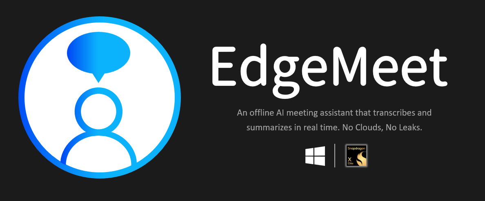
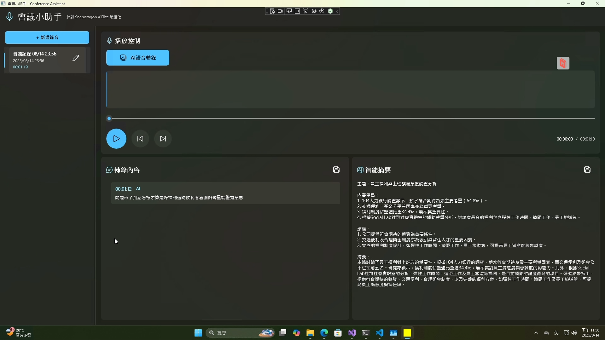
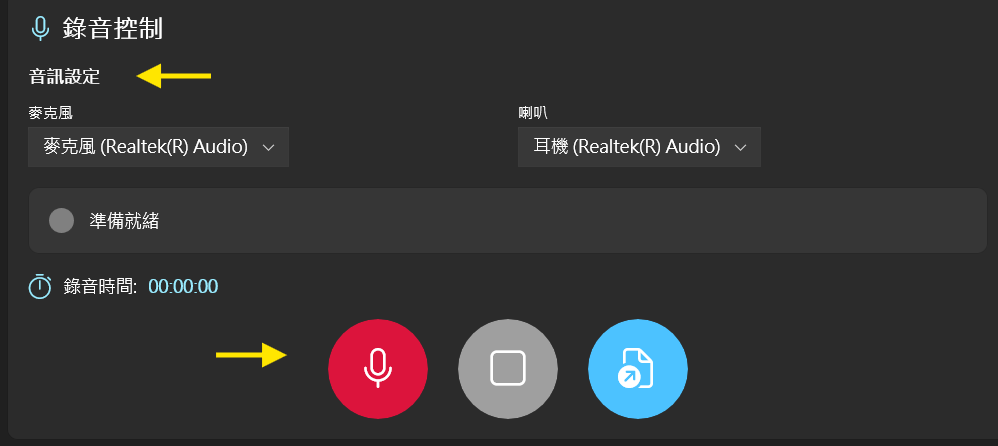

# EdgeMeet (Under Development)



This app (EdgeMeet) is provided as an offline AI meeting assistant sample, built using fine-tuned Whisper speech-to-text (ASR) and Llama 3.1 TAIDE summarization models. The application runs fully on-device, ensuring no cloud transmission and complete control over sensitive meeting data.

On Snapdragon X Elite, the models are optimized to leverage the Neural Processing Unit (NPU) for low-latency inference. The ASR supports multiple languages, including Chinese, English, and Taiwanese Hokkien, delivering accurate transcriptions and concise summaries in real-time. Elsewhere, the models will run on the CPU.

This project was developed for the **Qualcomm Edge AI Developer Hackathon**.

## Preview



## Table of Contents

- [Features](#features)
- [Project Structure](#project-structure)
- [Quick Start](#quick-start)
- [How to Use](#how-to-use)
- [Backend API](#backend-api)
- [Data Formats](#data-formats)
- [Frontend Key Files and Flow](#frontend-key-files-and-flow)
- [Configuration](#configuration)

## Features

- 🎙️ **Audio Recording**:
   - Supports microphone recording, system audio recording (loopback), and simultaneous recording mode (microphone + background audio from headphones/speakers)
   - Selectable input/output devices (including AirPods, speakers, and monitor audio)
   - Playback support
      - Play/Pause
      - Fast forward/rewind
      - Drag the progress bar to skip segments
- 🧾 **Meeting Data Management**:
   - After stopping recording, the following files are automatically generated:
      - base.wav (full recording)
      - transcript.json (paragraph-by-paragraph transcript)
      - summary.json (overall summary + paragraph summaries)
   - Supports renaming/deleting meeting records
   - Exports transcripts (.txt) or summaries (.txt)
- 🔍 **Full-text search**:
   - Search both transcripts and summaries
   - Search results automatically highlight keywords (yellow background)
   - Click a result to jump to the corresponding time segment
- 🎨 **Interface Features**:
   - Real-time waveform display (supports playback progress tracking)
   - Automatically adjusts the interface and title bar colors based on the Windows system theme color
   - Red breathing light animation during recording for clear status
- 🧠 **Smart Summary Display**:
   - During playback or recording: Displays a "Current Segment Cumulative Summary"
   - After stopping: Displays a "Full Overall Summary"
- ⚡ **Instant Upload**:
   - Automatically uploads every 20 seconds of recording, overlapping the previous segment by 2 seconds.
   - After a successful upload, the transcript of the segment is immediately displayed, and the segment summary is automatically updated.
     
## Project Structure

### Frontend (WinUI 3)

```text
ConferenceAssistant/
├─ Assets/ # Icon resource file
├─ Controls/
│ └─ RecordingStatusControl.xaml(.cs) # Recording status display
├─ Converters/
│ └─ ValueConverters.cs # Common converters
├─ Models/
│ ├─ ConferenceRecordDto.cs # Data model & backend API DTO
│ └─ SearchResultItem.cs # Search result data structure (including keyword highlighting)
├─ ViewModels/
│ ├─ MainViewModel.cs
│ │ # Core logic: recording, playback control, conference management, search
│ └─ MainViewModel.Streaming.cs # Streaming processing: real-time transcription/summary display
├─ Behaviors/
│ └─ HighlightBehavior.cs # Highlight search keywords in yellow
├─ App.xaml(.cs) # Application startup settings
├─ ThemeWatcher.cs # Follow the Windows theme background
├─ MainWindow.xaml # Front-end UI layout
└─ MainWindow.xaml.cs # UI interaction logic (progress bar dragging, theme color synchronization)
```

### Backend (FastAPI)

```text
app/
├─ main.py # FastAPI app entry point
├─ routes.py # Static and example routes for `/uploads`
├─ schemas.py # Pydantic models
└─ transcribe.py # Transcription and summarization APIs (ingest_chunk / finalize_stream / summary ...)

uploads/ # Generated outputs (each recording has a separate folder)
└─ <base_name>/
├─ base.wav
├─ transcript.json
├─ summary.json
└─ stream_chunks/ # 001.wav, 002.wav, ... (retained)
```

## Quick Start

### Backend

Pre.
Please first follow the instructions on the website to install Turu for Qualcomm AI Hackathon:
https://turu.thuniverse.ai/download/turu-25h1-wos/

1. Create a virtual environment and install dependencies (Python 3.10.8)
   ```bash
   python -m venv venv
   # Windows
   venv\Scripts\activate
   $env:KUWA_API_KEY="YOUR_API_KEY"
   pip install -r requirements.txt   # fastapi uvicorn pydub python-multipart etc.
   ```
2. Install ffmpeg and ensure it’s in the PATH (required by pydub).

3. Open the Turu platform.

4. Start the backend:
   ```bash
   uvicorn app.main:app --reload
   ```
   

### Frontend

- Open **ConferenceAssistant** in **Visual Studio 2022** (with .NET 8 and Windows App SDK/WinUI 3 workload) and run with F5.

- By default, the frontend will call the backend at `http://127.0.0.1:8000`.

## How to Use

### 1. Start a New Recording
- Select input/output devices  
- Click **"Start Recording"** → instantly shows volume indicator and waveform  
- Every **20 seconds**, a transcript segment is generated and the latest summary is displayed  

### 2. Stop Recording
- Recording is automatically merged into `base.wav`  
- Updates full transcript `transcript.json` and summary `summary.json`  

### 3. Upload Audio File
- Supports importing `.wav` / `.mp3` / `.m4a` / `.flac` files  
- System automatically uploads → transcribes → displays transcript and summary  

### 4. Playback Controls
- Play / Pause, Fast Forward / Rewind  
- Drag the progress bar to jump to a segment, summary updates accordingly   

### 5. Search & Highlight
- Enter a keyword in the search box to show related segments in **transcript** and **summary**  
- Keywords are automatically highlighted (yellow)  
- Click search results to jump to the corresponding time 

### 6. Export
- Export transcript or summary as `.txt` files  

## Backend API

| Method & Path                | Description                                                                                 | Parameters (Query / Body)                                             | Response (Summary)                                            |
| ---------------------------- | ------------------------------------------------------------------------------------------- | --------------------------------------------------------------------- | ------------------------------------------------------------- |
| **POST** `/ingest_chunk`     | Upload a 20s WAV chunk and upsert it to JSON in real-time                                   | Query: `base_name`, `index`; Body: `multipart/form-data` field `file` | `{ index, start, end, text, summary }`                        |
| **POST** `/finalize_stream`  | Stop recording: concatenate `stream_chunks/` → `base.wav` → segment memory → overwrite JSON | Query: `base_name`                                                    | `{ filename, base_name, status, paths }`                      |
| **GET** `/summary`           | Get the overall summary and per-segment summaries                                           | Query: `base_name`                                                    | `{ overall_summary, per_segment: [{ index, summary }], ... }` |
| **GET** `/segment_at`        | Get the segment for a specific timestamp                                                    | Query: `base_name`, `t`                                               | `{ index, start, end, text, summary }`                        |
| **GET** `/segments_in_range` | Get all segments in a specified range                                                       | Query: `base_name`, `start`, `end`                                    | `{ range, segments: [...] }`                                  |

## Data Formats

### `transcript.json`

```json
{
  "base_name": "recording_20250814_015628",
  "chunk_seconds": 20,
  "overlap_seconds": 2,
  "segments": [
    { "index": 1, "start": 0, "end": 20, "text": "..." },
    { "index": 2, "start": 18, "end": 38, "text": "..." }
  ]
}
```

### `summary.json`

```json
{
  "base_name": "recording_20250814_015628",
  "overall_summary": "...",
  "chunk_seconds": 20,
  "overlap_seconds": 2,
  "per_segment": [
    { "index": 1, "summary": "..." },
    { "index": 2, "summary": "..." }
  ]
}
```

## Frontend Key Files and Flow

### Key Files

- **`ViewModels/MainViewModel.cs`**  
  Core states, playback/segment skipping, `SmartSummary` calculation, calls to `/summary`, `/segment_at`, and triggers `finalize_stream` after stopping the recording.

- **`ViewModels/MainViewModel.Streaming.cs`**  
  Real-time upload: Every time **20s** of raw bytes are collected → package as WAV using `WaveFileWriter` → `POST /ingest_chunk`.  
  After upload, it immediately shows the **transcription** for the segment; **1 second later**, it calls `/summary`, updating the display with the **maximum `index`** from `per_segment`:

  - `CurrentSegmentSummary` (right-side summary card)
  - `SegmentSummaries` (list; Upsert; maintains order)  
    All UI updates are done via `_dispatcherQueue.TryEnqueue(...)`.

- **`Controls/RecordingStatusControl.xaml(.cs)`**  
  Visual component for recording status: style switching, animations, and status text.

- **`Models/ConferenceRecordDto.cs`**  
  Models corresponding to the backend API (e.g., `ApiSegment`, `ApiSummary`) and list items `SegmentSummaryItem`.

### Real-Time Flow (Diagram)

```text
flowchart LR
  A[NAudio Recording] -->|20s/segment, 2s overlap| B[Package WAV (WaveFileWriter)]
  B --> C[POST /ingest_chunk]
  C -->|Real-time upsert| D[transcript.json & summary.json]
  C -->|Return segment| E[UI immediately displays the transcription]
  E --> F[Delay 1 second GET /summary]
  F -->|Max index from per_segment| G[CurrentSegmentSummary & SegmentSummaries]
  A -->|Stop| H[POST /finalize_stream]
  H -->|stream_chunks → base.wav → memory segmentation| D
```

## Configuration

- Segment Specifications: `CHUNK_SECONDS = 20`, `OVERLAP_SECONDS = 2` (must match between frontend and backend)
- Audio Specifications: `base.wav` set to `16 kHz / mono / 16-bit PCM`
- Upload Folder: `uploads/<base_name>/`
- Environment File: Configure host/port/path in `.env` or programmatically

## License

[Apache License](LICENSE)
